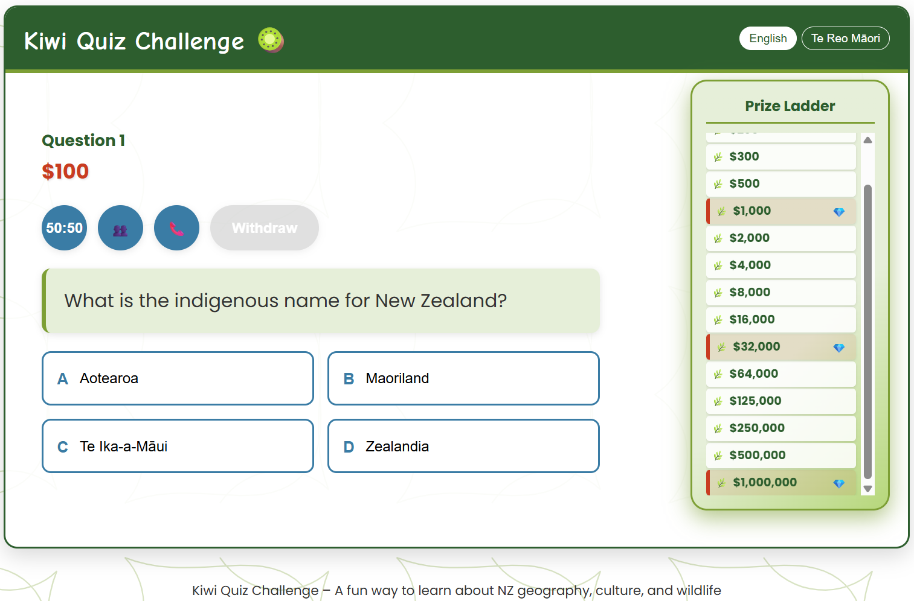
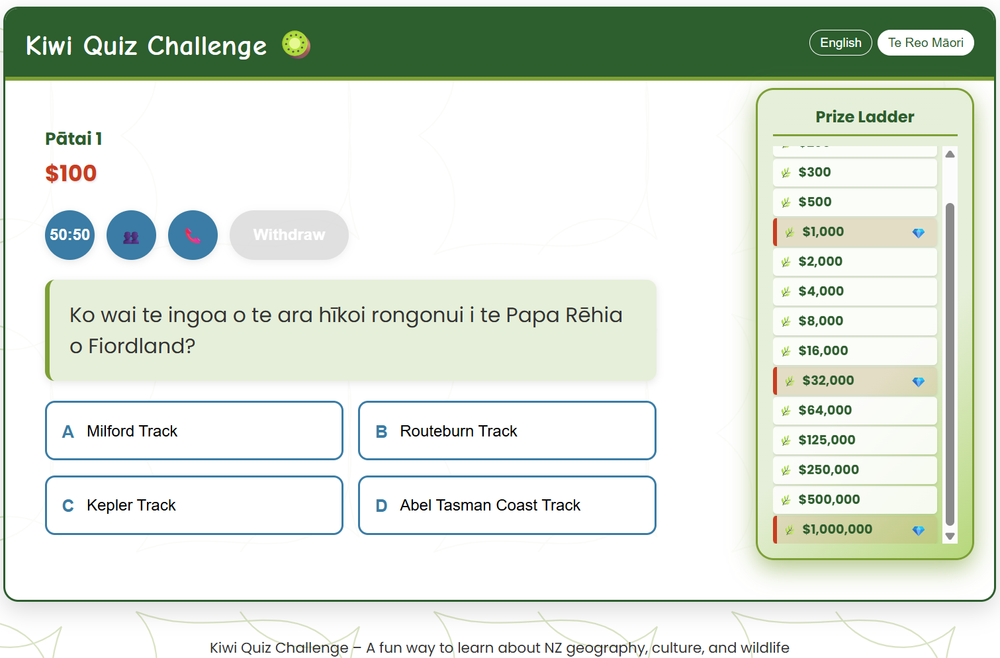

# Kiwi Quiz Challenge - Who Wants to Be a Millionaire

A fun, interactive quiz game celebrating the language, culture, and geography of Aotearoa New Zealand. Built entirely with HTML, CSS, and JavaScript — no frameworks, servers, or dependencies required. Powered by Amazon Q Developer CLI.

---

## 🌟 Features

* 💰 Classic "Who Wants to Be a Millionaire" format
* 🧠 50+ beginner-friendly questions about NZ history, nature, and culture
* 🗣️ Language toggle: English / Te Reo Māori
* 🚡 Lifelines: 50:50, Ask the Audience, Phone a Friend
* 🏆 Animated prize ladder and feedback
* 🔊 Sound effects and visual polish
* 🖥️ Works offline — just open in your browser
* 🌐 GitHub Pages–ready

---

## 🚀 Getting Started

1. Clone the repo:

   ```sh
   git clone https://github.com/jajera/q-kiwi-millionaire.git
   ```

2. Open `index.html` in your browser

3. Start the game — no server or setup needed

---

## 🌍 GitHub Pages Deployment

Easily deployable via GitHub Pages:

1. Push the project to GitHub
2. Go to **Settings > Pages**
3. Set source to `main` branch and root `/`
4. Access your quiz at `https://jajera.github.io/q-kiwi-millionaire/`

---

## 📚 Documentation

* [Using Q CLI](docs/using-q-cli.md)
* [Quiz Structure Prompt](docs/quiz-prompt.md)
* [Question Set Format](docs/question-format.md)

---

## 📸 Screenshots




---

## 🤝 Credits

* Created with Amazon Q Developer CLI, refined with human input
* Māori language support inspired by open educational initiatives
* Question set curated with beginner-friendly, non-offensive content

---

## 📄 License

This project is licensed under the MIT License. See the [LICENSE](LICENSE) file for details.
